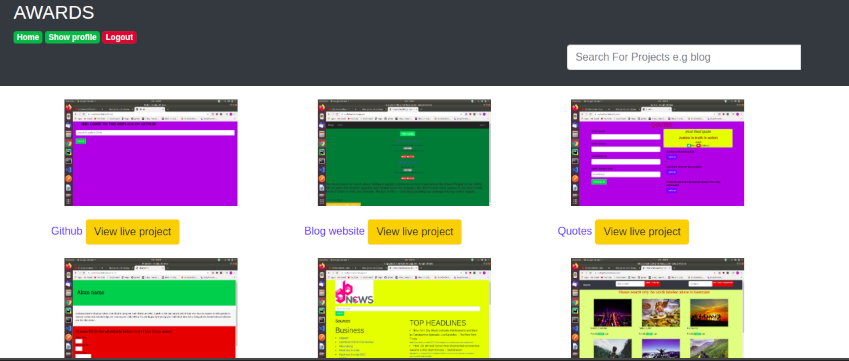

## Application name
Neshco-awards

[](https://opensource.org/licenses/MIT)
[](https://codebeat.co/projects/github-com-marknesh-awards-website-master)

## Visual Representation


## Description
This is basically an award's web application that allow the users to rate other people's projects according the design,usability and scalability.
The users can also post their own projects for the to be rated,but first they must sign in.


## Features
The main features include rating other people's projects ,creating the profile page and many others.
The users must first login inorder to create their own profile page.


## Technologies used

Django 3.0.3.
Bootstrap
Python3.6
Postgresql

# INSTALLATION

## Clone
```
https://github.com/marknesh/Awards-website.git

```

## Create a virtual environment
```
python3.6 -m venv --without-pip virtual

```
## Run migration
```
python3.6 manage.py makemigrtaions
python3.6 manage.py migrate

```
## Run server
```
python3.6 manage.py runserver

```
## Run test
```
python3.6 manage.py test
```

## Troubleshooting
If you encounter any problems please feel free to contact me using the contacts provided  below incase you encounter any bugs.

## Support and contact details
Contact us on : 0734353535
Email us on: neshco-awards@gmail.com

## Author
[marknesh]


